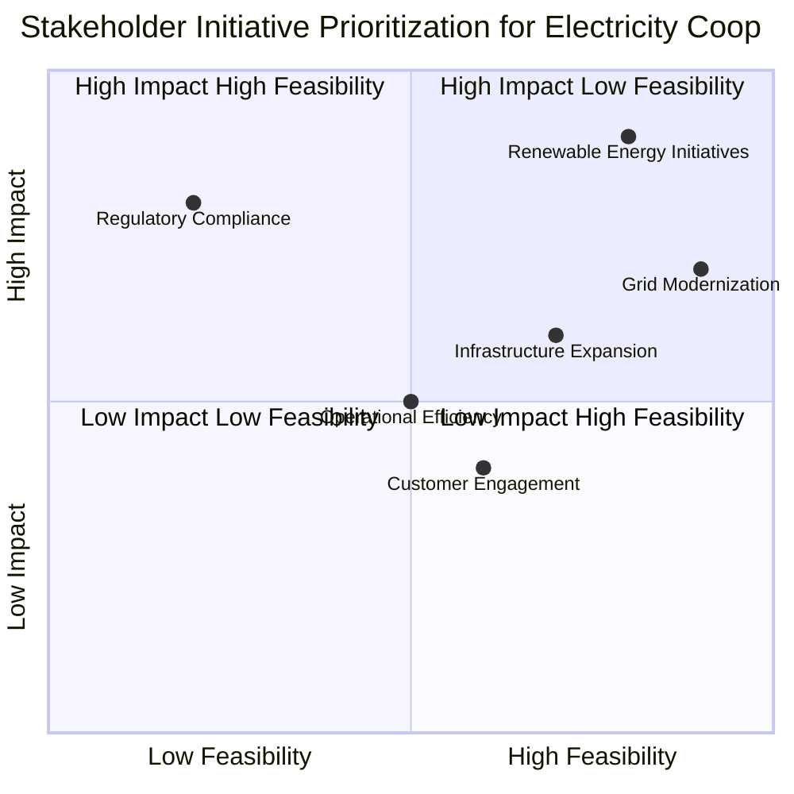

# Stakeholder Engagement

```mermaid
quadrantChart
    title Stakeholder Initiative Prioritization for Electricity Coop
    x-axis Low Feasibility --> High Feasibility
    y-axis Low Impact --> High Impact
    quadrant-1 High Impact  Low Feasibility
    quadrant-2 High Impact High Feasibility
    quadrant-3 Low Impact Low Feasibility
    quadrant-4 Low Impact High Feasibility
    "Renewable Energy Initiatives": [0.8, 0.9]
    "Grid Modernization": [0.9, 0.7]
    "Customer Engagement": [0.6, 0.4]
    "Regulatory Compliance": [0.2, 0.8]
    "Operational Efficiency": [0.5, 0.5]
    "Infrastructure Expansion": [0.7, 0.6]
```
