```mermaid
classDiagram
    class DataVisualizationProcess {
        +start()
        +defineObjectives()
        +collectData()
        +cleanAndPrepareData()
        +chooseVisualizationType()
        +createInitialVisualization()
        +analyzeAndInterpretData()
        +refineVisualization()
        +presentVisualization()
        +gatherFeedback()
        +iterateAndImprove()
        +end()
    }

    class DefineObjectives {
        +objective: String
        +setObjective(objective: String)
    }

    class CollectData {
        +dataSources: List
        +collect(dataSources: List)
    }

    class CleanAndPrepareData {
        +rawData: List
        +cleanedData: List
        +cleanData(rawData: List)
        +prepareData(cleanedData: List)
    }

    class ChooseVisualizationType {
        +visualizationType: String
        +chooseType(type: String)
    }

    class CreateInitialVisualization {
        +visualization: Object
        +create(visualizationType: String, data: List)
    }

    class AnalyzeAndInterpretData {
        +analysis: Object
        +interpretation: String
        +analyze(data: List)
        +interpret(analysis: Object)
    }

    class RefineVisualization {
        +refinedVisualization: Object
        +refine(visualization: Object)
    }

    class PresentVisualization {
        +presentation: Object
        +present(visualization: Object)
    }

    class GatherFeedback {
        +feedback: List
        +gather()
    }

    class IterateAndImprove {
        +improvements: List
        +iterate(feedback: List)
        +improve()
    }

    DataVisualizationProcess --> DefineObjectives
    DataVisualizationProcess --> CollectData
    DataVisualizationProcess --> CleanAndPrepareData
    DataVisualizationProcess --> ChooseVisualizationType
    DataVisualizationProcess --> CreateInitialVisualization
    DataVisualizationProcess --> AnalyzeAndInterpretData
    DataVisualizationProcess --> RefineVisualization
    DataVisualizationProcess --> PresentVisualization
    DataVisualizationProcess --> GatherFeedback
    DataVisualizationProcess --> IterateAndImprove
```

# Data Visualization 

## Tackling Messy Data for Visualization with Python Tools

Messy data is a common challenge when preparing datasets for visualization. Addressing this requires robust tools and workflows to clean, manipulate, and organize data. Python provides a versatile ecosystem for these tasks, leveraging libraries like Pandas, Dask, Dagster, and SQLite. 

## Step 1: Loading and Inspecting Data

Tools: Pandas, SQLite
Start by loading your data into a manageable format. For smaller datasets, Pandas is the go-to tool. For larger, distributed data or shared storage, SQLite can efficiently handle tabular data.

```python
import pandas as pd
import sqlite3

# Load data from SQLite
conn = sqlite3.connect('data.db')
data = pd.read_sql_query("SELECT * FROM sales_data", conn)

# Quick inspection
print(data.head())
print(data.info())  # Check for missing or inconsistent data
```

Step 2: Cleaning Data

Messy data often contains missing values, duplicates, or inconsistent formats. Pandas offers powerful methods to clean this data interactively.

Handling Missing Values:
```python 
# Fill missing values with a placeholder or interpolate
data['revenue'].fillna(0, inplace=True)

# Drop rows with critical missing data
data.dropna(subset=['date', 'region'], inplace=True)
```

Remove Duplicate Rows
```python
# Remove duplicate rows
data.drop_duplicates(inplace=True)
```

Standarize Formats
```python
# Ensure consistent date formats
data['date'] = pd.to_datetime(data['date'])
```

Step 3: Scaling Up with Dask

When working with datasets too large for memory, Dask extends Pandas-like operations for scalable processing.

```python
import dask.dataframe as dd

# Load large dataset with Dask
dask_data = dd.read_csv('large_sales_data.csv')

# Perform operations (e.g., filling missing values)
dask_data['revenue'] = dask_data['revenue'].fillna(0)

# Compute results
cleaned_data = dask_data.compute()
```

Step 4: Orchestrating Pipelines with Dagster

To manage complex workflows, such as integrating cleaning, transformation, and storage tasks, Dagster provides a robust orchestration layer.

```python
from dagster import job, op

@op
def load_data():
    return pd.read_csv('sales_data.csv')

@op
def clean_data(raw_data):
    return raw_data.dropna().drop_duplicates()

@op
def save_to_sqlite(cleaned_data):
    conn = sqlite3.connect('cleaned_data.db')
    cleaned_data.to_sql('sales_data_cleaned', conn, if_exists='replace')

@job
def data_cleaning_pipeline():
    raw_data = load_data()
    cleaned_data = clean_data(raw_data)
    save_to_sqlite(cleaned_data)
```

Step 5: Storing and Distributing Cleaned Data

After cleaning, SQLite provides an excellent lightweight option for storing and sharing relational data. Use Pandas to save processed data into SQLite for reuse.

```python
cleaned_data.to_sql('cleaned_table', conn, if_exists='replace')
```

