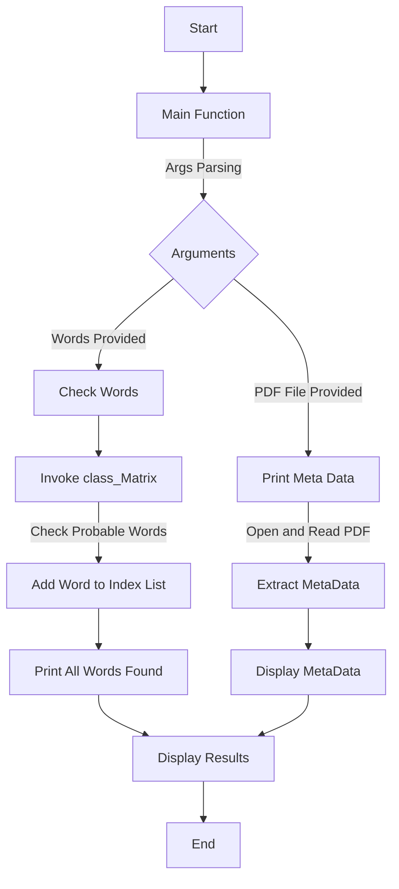

# PDF Scraping and Record Linkage

## Argument Parsing
The script starts by parsing command-line arguments using the argparse module. It expects the name of a PDF file and an optional list of words to check.

## PDF Metadata Extraction
The print_meta function is responsible for extracting and displaying metadata from the specified PDF file. It opens the PDF file in binary read mode, reads its metadata using PdfFileReader, and prints each metadata item.

## Word Probability Checking
The script includes a class class_Matrix with a method isWordProbable that checks if a word is probable. The check_words function iterates through the provided list of words, checks their probability using class_Matrix, and stores the indices of probable words.

## Displaying Results
The print_all_words_found function sorts and prints the list of probable words along with their indices.

## How It Operates
### Main Function
The main function orchestrates the entire process:

## Argument Parsing: 

Parses the PDF file name and optional words list.
PDF Metadata Extraction: If a PDF file is provided, it invokes print_meta to extract and display metadata.

Word Probability Checking: If a list of words is provided, it invokes check_words to check the probability of each word and print_all_words_found to display the results.

