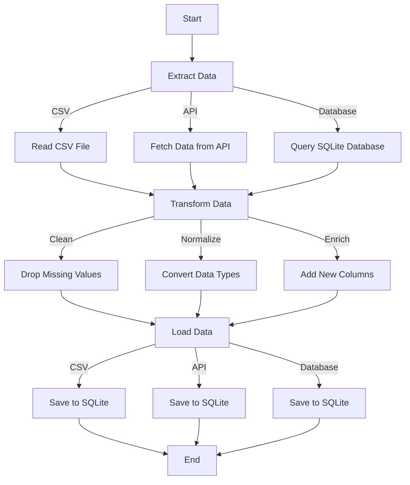

# Python ETL Workflows


## Introduction
ETL (Extract, Transform, Load) workflows are essential for data integration and processing. This article provides a sample flow of a Python ETL workflow, demonstrating how to extract data from various sources, transform it, and load it into a target system.

## ETL Workflow Overview

### Step 1: Extract Data
The extraction phase involves retrieving data from various sources such as databases, APIs, and files.

### Step 2: Transform Data
The transformation phase involves cleaning, normalizing, and enriching the data to meet the requirements of the target system.

### Step 3: Load Data
The loading phase involves inserting the transformed data into the target system, such as a database or data warehouse.

## Sample ETL Workflow

### Step 1: Extract Data

**Tools**: `pandas`, `requests`, `sqlite3`

```python
import pandas as pd
import requests
import sqlite3

# Extract data from a CSV file
csv_data = pd.read_csv('data.csv')

# Extract data from an API
response = requests.get('https://api.example.com/data')
api_data = response.json()

# Extract data from a SQLite database
conn = sqlite3.connect('data.db')
db_data = pd.read_sql_query("SELECT * FROM table_name", conn)
```

# Step 2 Transform Data

```python
# Clean and normalize CSV data
csv_data.dropna(inplace=True)
csv_data['date'] = pd.to_datetime(csv_data['date'])

# Normalize API data
api_df = pd.DataFrame(api_data)
api_df['value'] = api_df['value'].astype(float)

# Enrich database data
db_data['new_column'] = db_data['existing_column'] * 2
```

# Step 3 Load Data

```python 
# Load transformed data into a new SQLite database
conn = sqlite3.connect('transformed_data.db')

# Save CSV data
csv_data.to_sql('csv_table', conn, if_exists='replace', index=False)

# Save API data
api_df.to_sql('api_table', conn, if_exists='replace', index=False)

# Save database data
db_data.to_sql('db_table', conn, if_exists='replace', index=False)
```

## Workflow Diagram 


