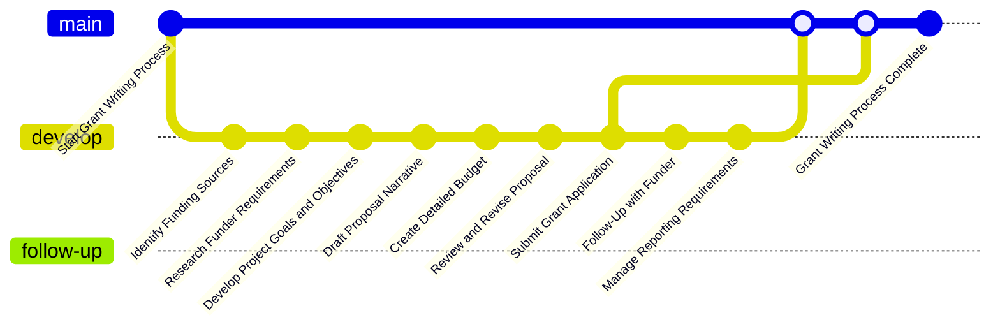
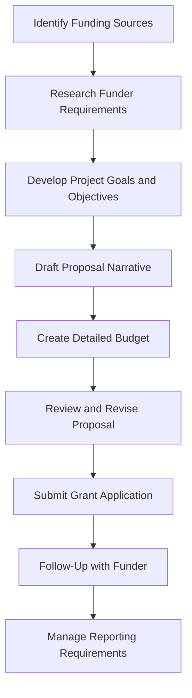

### Expertise in Grant Writing

- **Proposal Development**: Skilled at developing compelling grant proposals that align with organizational goals and funder priorities.

- **Research and Analysis**: Conducts thorough research to identify potential funding sources and understands their requirements.

- **Clear Communication**: Communicates project goals, objectives, and outcomes clearly and persuasively in grant applications.
- **Detail-Oriented**: Pays meticulous attention to detail, ensuring all grant application components are complete and accurate.
- **Budgeting Skills**: Develops detailed and realistic budgets that align with project needs and funder guidelines.
- **Impact Articulation**: Effectively articulates the potential impact and significance of the proposed activities to secure funding.
- **Follow-Up and Reporting**: Manages follow-up communications and reporting requirements to maintain positive relationships with funders.
