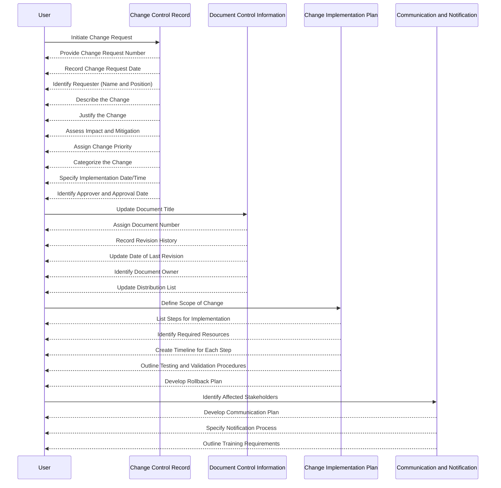

# Project Management

```mermaid
sequenceDiagram
    participant User as User
    participant ChangeControl as Change Control Record
    participant DocumentControl as Document Control Information
    participant ChangePlan as Change Implementation Plan
    participant Communication as Communication and Notification

    User->>ChangeControl: Initiate Change Request
    ChangeControl-->>User: Provide Change Request Number
    ChangeControl-->>User: Record Change Request Date
    ChangeControl-->>User: Identify Requester (Name and Position)
    ChangeControl-->>User: Describe the Change
    ChangeControl-->>User: Justify the Change
    ChangeControl-->>User: Assess Impact and Mitigation
    ChangeControl-->>User: Assign Change Priority
    ChangeControl-->>User: Categorize the Change
    ChangeControl-->>User: Specify Implementation Date/Time
    ChangeControl-->>User: Identify Approver and Approval Date

    User->>DocumentControl: Update Document Title
    DocumentControl-->>User: Assign Document Number
    DocumentControl-->>User: Record Revision History
    DocumentControl-->>User: Update Date of Last Revision
    DocumentControl-->>User: Identify Document Owner
    DocumentControl-->>User: Update Distribution List

    User->>ChangePlan: Define Scope of Change
    ChangePlan-->>User: List Steps for Implementation
    ChangePlan-->>User: Identify Required Resources
    ChangePlan-->>User: Create Timeline for Each Step
    ChangePlan-->>User: Outline Testing and Validation Procedures
    ChangePlan-->>User: Develop Rollback Plan

    User->>Communication: Identify Affected Stakeholders
    Communication-->>User: Develop Communication Plan
    Communication-->>User: Specify Notification Process
    Communication-->>User: Outline Training Requirements
```